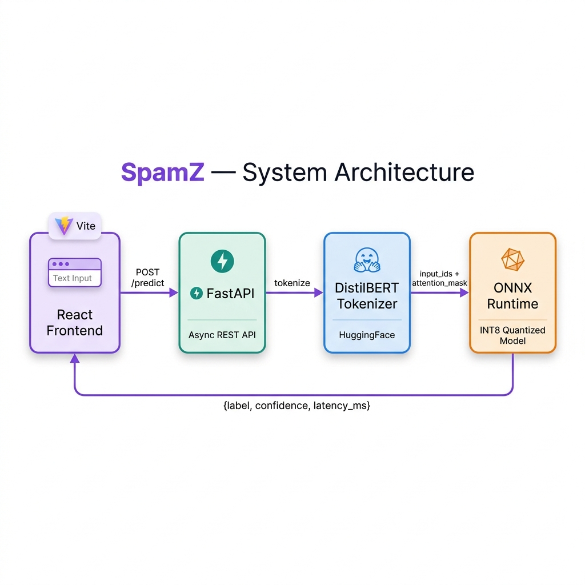
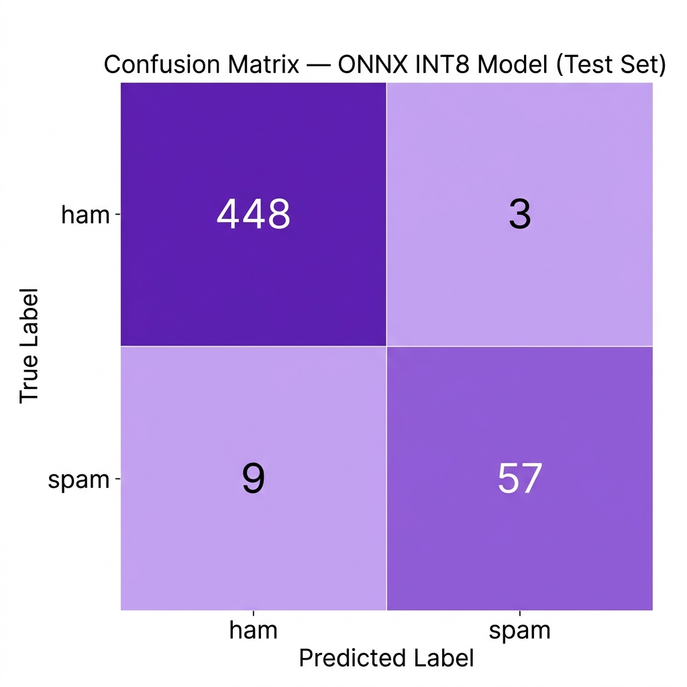

<p align="center">
  
</p>

<h1 align="center">SpamZ</h1>
<p align="center">
  <strong>Real-time SMS spam classification powered by a fine-tuned DistilBERT model, served at sub-25ms latency via ONNX Runtime INT8 quantization.</strong>
</p>

<p align="center">
  <a href="#quick-start">Quick Start</a> •
  <a href="#architecture">Architecture</a> •
  <a href="#benchmarks">Benchmarks</a> •
  <a href="#api-reference">API Reference</a> •
  <a href="#testing">Testing</a> •
  <a href="#live-demo">Live Demo</a>
</p>

---

## Highlights

| Feature | Detail |
|---------|--------|
| **Model** | `distilbert-base-uncased` fine-tuned on 5,169 SMS messages |
| **Inference** | ONNX Runtime with dynamic INT8 quantization |
| **Latency** | **19 ms** mean / **25 ms** p95 (7× faster than PyTorch) |
| **API** | Async FastAPI, single `POST /predict` endpoint |
| **Frontend** | Vite + React SPA with real-time classification UI |
| **Model Size** | 67 MB (INT8) vs 268 MB (FP32) — **75% reduction** |

---

## Architecture

```
┌──────────────┐  POST /predict  ┌──────────────┐  tokenize   ┌───────────────┐
│              │ ──────────────► │              │ ──────────► │  DistilBERT   │
│  React + Vite│                 │   FastAPI    │             │  Tokenizer    │
│  Frontend    │ ◄────────────── │  (async)     │ ◄────────── │  (HuggingFace)│
│              │  JSON response  │              │  input_ids  │               │
└──────────────┘                 └──────┬───────┘             └───────────────┘
                                        │
                                        │ numpy arrays
                                        ▼
                                 ┌──────────────┐
                                 │  ONNX Runtime │
                                 │  INT8 Model   │
                                 │  (19ms avg)   │
                                 └──────────────┘
```

<details>
<summary><strong>Pipeline stages</strong></summary>

1. **Data Preparation** (`pipeline.py`) — Load `spam.csv`, deduplicate (5,572 → 5,169), stratified 80/10/10 split, compute class weights (ham: 0.57, spam: 3.96), tokenize with `distilbert-base-uncased` (max_length=128).
2. **Training** (`train.py`) — Fine-tune with weighted `CrossEntropyLoss`, 3 epochs, lr=2e-5, early stopping on validation F1. Threshold optimized on validation PR curve (recall ≥ 85%).
3. **ONNX Export** (`export_onnx.py`) — Export PyTorch checkpoint to ONNX opset 14 with dynamic axes.
4. **INT8 Quantization** (`quantise_int8_v3.py`) — Dynamic quantization via HuggingFace Optimum (AVX-512 VNNI).
5. **Serving** (`app.py`) — FastAPI loads the ONNX session once at startup; each request tokenizes → runs inference → returns label + confidence + latency.
6. **Frontend** (`frontend/`) — Vite + React SPA with a single-page classifier interface.

</details>

---

## Quick Start

### Option 1 — Docker Compose (recommended)

```bash
git clone https://github.com/ShadwalSingh/SpamZ.git
cd SpamZ
docker compose up
```

The API will be available at `http://localhost:8000` and the frontend at `http://localhost:3000`.

### Option 2 — Local Development

**Prerequisites**: Python 3.10+, Node.js 18+

```bash
# Clone and enter the project
git clone https://github.com/ShadwalSingh/SpamZ.git
cd SpamZ

# Backend
python -m venv venv
venv\Scripts\activate        # Windows
pip install -r requirements.txt
pip install onnxruntime fastapi uvicorn httpx
uvicorn app:app --reload --port 8000

# Frontend (new terminal)
cd frontend
npm install
npm run dev
```

Open **http://localhost:3000** in your browser.

### Option 3 — API only

```bash
pip install fastapi uvicorn onnxruntime transformers numpy
uvicorn app:app --host 0.0.0.0 --port 8000
```

---

## Benchmarks

Measured on an Intel i7 CPU over 1,000 test-set samples. Full benchmark script: [`benchmark.py`](benchmark.py).

### Latency: PyTorch vs ONNX INT8

| Runtime | Mean Latency | p95 Latency | Speedup |
|---------|:------------:|:-----------:|:-------:|
| **PyTorch (FP32)** | 135.33 ms | 143.05 ms | 1.0× |
| **ONNX INT8** | **19.04 ms** | **24.70 ms** | **7.1×** |

### Model Size

| Format | Size |
|--------|:----:|
| PyTorch (`.safetensors`) | 268 MB |
| ONNX FP32 (`.onnx`) | 268 MB |
| **ONNX INT8** | **67 MB** |

### Confusion Matrix (Test Set — 517 samples)

<p align="center">
  
</p>

---

## API Reference

### `POST /predict`

Classify a single SMS message as **spam** or **ham**.

**Request**

```json
{
  "text": "Congratulations! You've won a $1000 gift card. Click here to claim."
}
```

| Field | Type | Required | Description |
|-------|------|:--------:|-------------|
| `text` | `string` | ✅ | The SMS message body to classify |

**Response** `200 OK`

```json
{
  "label": "spam",
  "confidence": 0.9731,
  "latency_ms": 18.42
}
```

| Field | Type | Description |
|-------|------|-------------|
| `label` | `"spam"` \| `"ham"` | Predicted class |
| `confidence` | `float` | Probability of the spam class (0–1) |
| `latency_ms` | `float` | ONNX inference time in milliseconds |

**Error Responses**

| Status | Condition | Body |
|--------|-----------|------|
| `400` | Empty `text` field | `{"detail": "Empty text"}` |
| `422` | Missing or malformed body | Pydantic validation error |

**cURL Example**

```bash
curl -X POST http://localhost:8000/predict \
  -H "Content-Type: application/json" \
  -d '{"text": "Hey, are you free for lunch?"}'
```

---

## Testing

The test suite covers three layers:

| Layer | File | What it tests |
|-------|------|---------------|
| **Unit** | `tests/test_tokenizer.py` | Tokenizer output shapes, truncation, special tokens, dtypes |
| **Model** | `tests/test_model.py` | ONNX inference on known ham/spam examples, output shapes, determinism |
| **Integration** | `tests/test_api.py` | FastAPI endpoint schema, status codes, field types, latency regression |

### Running tests

```bash
# Install test dependencies
pip install pytest httpx

# Run the full suite
pytest -v

# Run only unit tests (no model required)
pytest tests/test_tokenizer.py -v

# Run integration tests
pytest tests/test_api.py -v
```

### Latency Regression

The `TestLatencyRegression` class in `test_api.py` enforces a **100 ms** ceiling on:
- Single inference latency
- Average latency over 10 diverse messages
- p95 latency over 20 requests

If a future change makes inference slower than 100 ms, **CI fails automatically**.

---

## Project Structure

```
SpamZ/
├── app.py                     # FastAPI server with /predict endpoint
├── benchmark.py               # PyTorch vs ONNX latency benchmarks
├── pipeline.py                # Data loading, dedup, stratified split, tokenization
├── train.py                   # Fine-tuning with weighted loss + threshold tuning
├── export_onnx.py             # PyTorch → ONNX export
├── quantise_int8_v3.py        # Dynamic INT8 quantization (Optimum)
├── validate_accuracy.py       # ONNX accuracy validation on test set
├── eda.py                     # Exploratory data analysis
├── spam.csv                   # Raw SMS dataset (5,572 messages)
├── requirements.txt           # Python dependencies
├── pytest.ini                 # Pytest configuration
├── README.md                  # ← You are here
│
├── models/
│   └── distilbert-spam/
│       ├── best/              # Fine-tuned checkpoint (safetensors + tokenizer)
│       ├── model.onnx         # ONNX FP32 export
│       └── model_int8.onnx    # ONNX INT8 quantized (production)
│
├── processed_data/
│   ├── train.pt / val.pt / test.pt   # Tokenized datasets
│   ├── class_weights.npy             # Computed class weights
│   └── optimal_threshold.json        # Decision threshold (0.85)
│
├── plots/
│   ├── architecture.png       # System architecture diagram
│   ├── confusion_matrix.png   # Test-set confusion matrix
│   └── length_distribution.png # EDA: message length histogram
│
├── reports/
│   ├── report_1.md            # Phase 1: Data & Pipeline
│   ├── report_2.md            # Phase 2: Training & Evaluation
│   ├── benchmark_report.md    # Latency benchmarks
│   └── onnx_accuracy.md       # ONNX accuracy metrics
│
├── tests/
│   ├── conftest.py            # Shared fixtures (tokenizer, ONNX session, TestClient)
│   ├── test_tokenizer.py      # Unit tests — tokenizer shapes
│   ├── test_model.py          # Model tests — ONNX inference
│   └── test_api.py            # Integration + latency regression tests
│
└── frontend/
    ├── index.html             # Entry HTML with SEO meta
    ├── vite.config.js         # Vite config with API proxy
    ├── public/favicon.svg     # SpamZ favicon
    └── src/
        ├── main.jsx           # React entry point
        ├── App.jsx            # Classifier SPA component
        ├── App.css            # Component styles
        └── index.css          # Global design tokens
```

---

## License

MIT © Shadwal Singh
